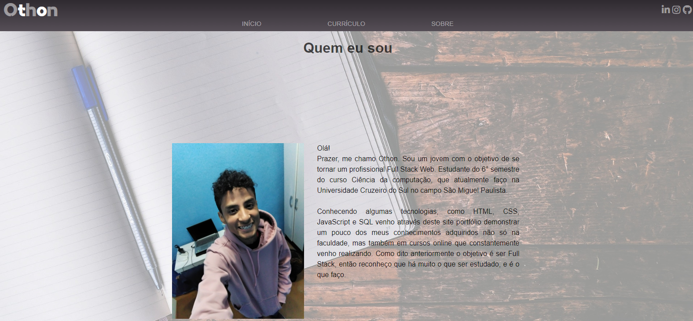

# Portfólio Othon
<p>
  Um site portfólio para demonstrar meus conhecimentos e interesses na área de desenvolvimento, desenvolvido por mim com HTML5, CSS3 e JavaScrit.
</p>

<p>
  No site encontra-se alguns trabalhos desenvolvidos durante cursos online realizados na Udemy e também na Origamid.
  Como não possuo experiência na área, sem ser acadêmica, o site me serviu como uma maneira de demonstrar os conhecimentos sobre desenvolvimento web que possuo. <br>
  A intenção está além de só demonstrar meus conhecimentos, mas também de ganhar, através de alguma oportunidade de trabalho.
</p>

<p>
  O site possui projetos envolvendo conteúdos sobre posicionamentos de elementos, layouts fixos, líquidos e reponsivos, com CSS Grid e Flexbox e também com o framework Bootstrap.
</p>

Pode ser acessado através do link: 

```bash
  othonss.github.io/portfolio-othon/
```

## Layout web

### Tela inicial


### Tela sobre


## Layout mobile

### Tela menu


### Tela inicial 

<div style="display: flex; grid-gap 10px;">
  
  
</div>

### Tela sobre
<div style="display: flex; grid-gap 10px;">
  
  
</div>

## Tecnologias utilizadas
<p>Linguagens e padrões que foram utilizados para desenvolver o app</p>

## Front-end
- HTML / CSS / JS

### Competências 
- Layout responsivo 

## Como executar o projeto

Instruções para executar o app

## Front-end
Pré-requisitos: Navegador

Clonar repositório

```bash
  https://github.com/othonss/Portfolio-Othon
```
Editar com IDE ou Editor de preferência

Acessar utilizando navegador de preferência

## Autor 

Othon Santos da Silva

<a href="https://www.linkedin.com/in/othon-santos-35531b129/" target="_blank">
    
 </a>
